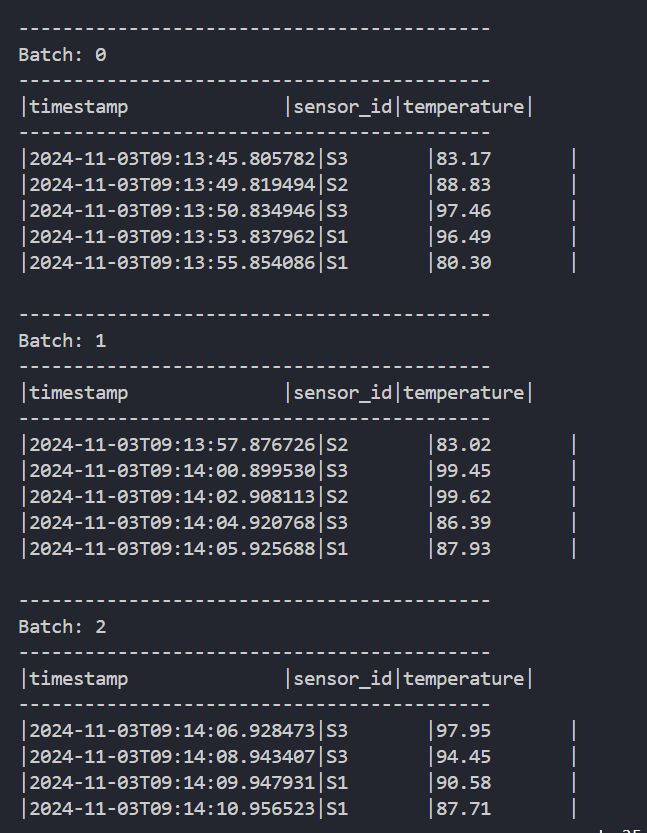
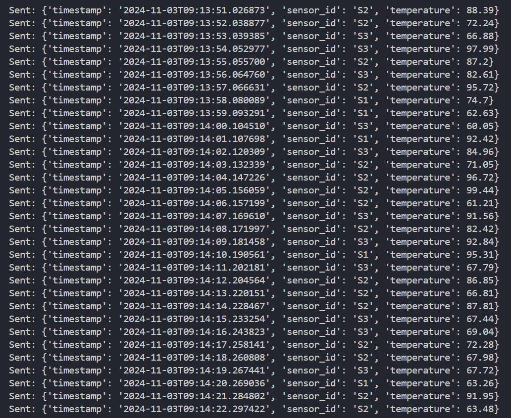

### Tugas Real-time Sensor Data Processing dengan Apache Kafka dan PySpark

| NRP        | Nama                |
| ---------- | ------------------- |
| 5027221005 | Bhisma Elki Pratama |
| 5027221014 | Siti Nur Ellyzah    |

#### Latar Belakang

Sebuah pabrik memiliki beberapa mesin yang dilengkapi sensor suhu. Data suhu dari mesin-mesin ini perlu dipantau secara real-time untuk menghindari overheating. Tugas ini bertujuan untuk mengimplementasikan sistem yang dapat mengumpulkan, menyimpan, dan menganalisis data suhu yang dikirimkan oleh sensor setiap detik

#### Tujuan

- Mengerti cara kerja Apache Kafka dalam menangani data stream dari sensor
- Membuat producer dan consumer sederhana
- Melakukan pengolahan data menggunakan PySpark

#### Arsitektur

Tugas ini melibatkan dua komponen utama:

1. **Producer**: Mengirim data suhu ke Kafka
2. **Consumer**: Mengkonsumsi data dari Kafka dan memfilter suhu yang melebihi 80°C

#### Persyaratan

- Docker dan Docker Compose
- Python (dengan library `kafka-python`)
- PySpark
- Apache Kafka

#### Struktur Proyek

.
├── docker-compose.yaml
├── producer.py
├── consumer.py
├── image
└── README.md

````

## Langkah-langkah instalasi dan menjalankan proyek

### 1. Menjalankan afka dan Zookeeper dengan Docker
Docker dan Docker Compose pastikan sudah terinstall. Menggunakan file `docker-compose.yaml` untuk menjalankan Apache Kafka dan Zookeeper.

```bash
docker-compose up -d
````

#### 2. Menjalankan Producer

Producer bertugas mengirimkan data suhu dari sensor setiap detik ke Kafka

**Instal library `kafka-python`:**

```bash
!pip install kafka-python atau pip install kafka-python
```

**run producer dengan perintah berikut:**

```bash
python producer.py
```

**penjelasan Producer:**

- script `producer.py` mengirimkan data JSON yang berisi:
  - `timestamp`: Waktu pengiriman data
  - `sensor_id`: ID sensor yang dipilih secara acak dari daftar sensor
  - `temperature`: Suhu acak antara 60°C hingga 100°C

#### 3. Menjalankan Consumer

Consumer bertugas membaca data dari Kafka, memfilter suhu di atas 80°C, dan menampilkan hasil ke display console

**Instal PySpark:**

```bash
!pip install pyspark atau pip install pyspark
```

**run consumer dengan perintah berikut:**

```bash
python consumer.py
```

**Penjelasan Consumer:**

- script `consumer.py` membaca data dari topik `sensor-suhu`, melakukan filter suhu di atas 80°C, dan mencetak data ke console sebagai peringatan

## Hasil yang

- **Producer**: Mengirim data suhu ke topik Kafka "sensor-suhu" setiap detik
- **Consumer**: Mencetak data suhu yang melebihi 80°C ke console secara real-time

**Output di console:**



## NOTE

- Pastikan `localhost:9092` dapat diakses dan Kafka berjalan dengan lancar
- Jika ada kendala, periksa log Docker dengan `docker-compose logs`

## Troubleshooting

- **Kafka tidak terhubung**: Pastikan Kafka dan Zookeeper berjalan dengan benar (`docker-compose ps`)
- **PySpark tidak mengenali Kafka**: Pastikan PySpark dapat menemukan Kafka client library. Tambahkan library terkait jika perlu

## Referensi

- [Apache Kafka Documentation](https://kafka.apache.org/documentation/)
- [PySpark Streaming Guide](https://spark.apache.org/docs/latest/streaming-programming-guide.html)
- [Docker Compose Documentation](https://docs.docker.com/compose/)
